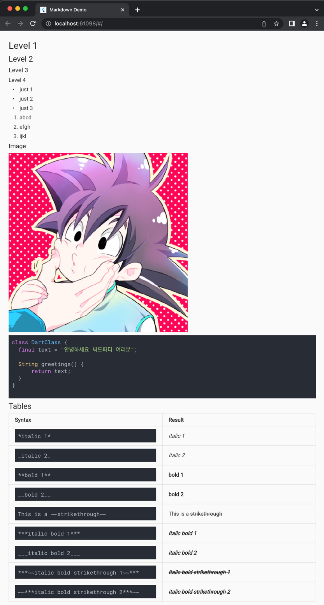

# flutter_md_viewer

.md 파일만 작성해도 웹페이지가 생성되는 Flutter Web 만들어보기

### Why
- [Hexo](https://hexo.io/ko/index.html)에서 지원하는 기능을 내가 좀더 유연하게 UI를 그릴 수 있는 Flutter로 그리면 좋을 것 같아서 시작

### Goal
- Markdown 파일을 커밋하는 것만으로 Flutter Web에서 반응하여 페이지가 추가될 수 있도록 구현해보기
- 지금 매일 성경 QT를 적고 있는 블로그를 flutter_md_viewer로 대체하기
- 기존의 Hexo Web에서 제공하던 기능을 최대한 살려보고, 추가도 해보기

<!--suppress ALL -->

~~너무 삽질 같으면 접고...~~
